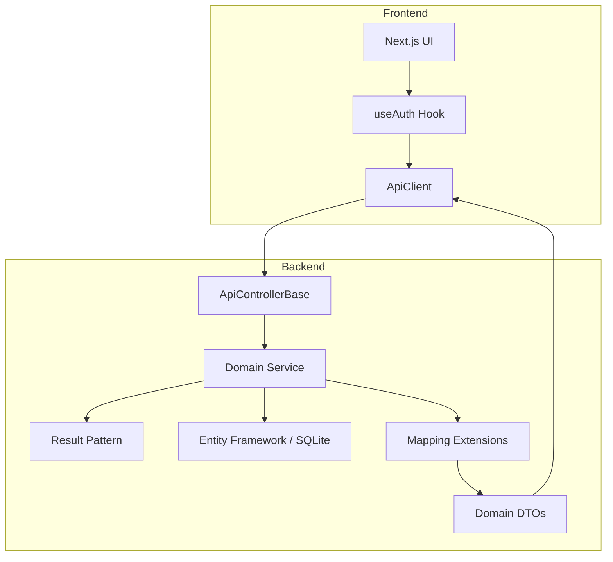

# WorkSwap

A professional-grade shift management and swap system built with **ASP.NET Core 10** and **Next.js 15**. Designed for high readability, engineered architecture, and modern UX/UI.

## 🏗️ Architecture & Patterns

This project has been refactored to demonstrate industry-standard software engineering practices.

### Backend: Clean Architecture & Functional Patterns
- **Result Pattern**: Replaced exceptions for flow control with a generic `Result<T>` pattern. This ensures predictable error handling and eliminates "magic" status code mapping in controllers.
- **Thin Controllers**: All controllers inherit from `ApiControllerBase`, which provides standardized `HandleResult` methods to translate domain results into HTTP responses.
- **Service Layer**: Pure business logic encapsulated in services, ensuring atomic transactions and consistency.
- **Mapping Layer**: Utilizes centralized mapping extensions for entity-to-DTO conversion, preventing domain model leakage.
- **Centralized Auth**: Claims-based authorization with custom principal extensions for clean user ID extraction.

### Frontend: Modern Logic & Premium Design
- **Class-based API Client**: A robust, stateful `ApiClient` class that handles token management, standardized error parsing, and type-safe requests.
- **Custom Auth Hook**: `useAuth` hook centralizes authentication state, loading indicators, and session persistence.
- **Type Safety**: Shared interfaces in `types/index.ts` ensure end-to-end type safety between backend DTOs and frontend components.
- **Brutalist Design System**: A high-contrast, premium "Brutalist" UI using CSS variables, custom typography (Inter), and sharp, shadow-hardened components.

## 📊 System Flow



## 🚀 Tech Stack

- **Backend**: ASP.NET Core 10.0 (Web API)
- **Frontend**: Next.js 15 (App Router), Tailwind CSS v4, Lucide Icons
- **Database**: SQLite (local file-based database)
- **Authentication**: ASP.NET Identity + JWT Bearer tokens
- **ORM**: Entity Framework Core
- **Testing**: xUnit + Custom Test Fixture (integration tests)

## 🛠️ Local Setup

### Prerequisites
- [.NET 10.0 SDK](https://dotnet.microsoft.com/download)
- [Node.js 20+](https://nodejs.org/)

### Installation

1. **Clone & Install**:
   ```bash
   git clone https://github.com/yourusername/workswap.git
   cd workswap
   dotnet restore
   cd web && npm install
   ```

2. **Database Initialization**:
   ```bash
   cd ..
   dotnet ef database update
   ```

3. **Run Dev Servers**:
   - **Backend**: `dotnet run --project workswap` (runs on `https://localhost:5001`)
   - **Frontend**: `cd web && npm run dev` (runs on `http://localhost:3000`)

## 🧪 Testing

The project includes a robust integration test suite using a custom `WorkswapTestFixture` to minimize boilerplate.

```bash
dotnet test
```

## 📄 License
MIT License.
